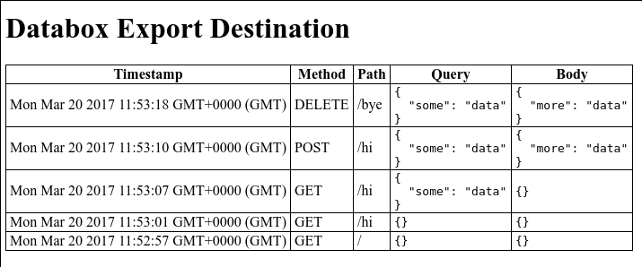

# Databox Export Destination

A simple web server that logs all incoming requests and displays them in real time.

Live version at https://export.amar.io/.

## Install

	npm install

## Run

	[PORT=8080] npm start

## Use

	http://localhost[:PORT][/some/path]

Any request made to this server will be pushed to the top of the table in real time thanks to WebSocket magic.

The `path` column will be relative to the URL path, and only requests made to the URL path or any sub-paths will be logged. This is useful for namespacing, so that you don't see the requests of other people using this service. Conversely, all requests are logged to the root path `/`. In other words, requests to `/a/b` will log on `/a/b`, `/a`, and `/`.

